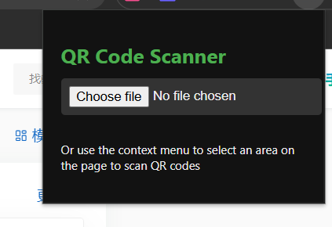
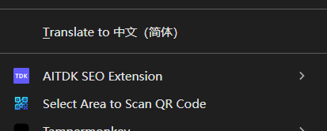

# QR Scanner with Area Selection

A Chrome Extension that allows you to **scan QR codes** either by:

- Uploading an image from your computer
- Selecting a specific area on any webpage for **instant QR code recognition**

✨ **Supports both light and dark themes.**

## 🚀 Features

- 📷 Upload any image containing a QR code and scan it
- 🔍 Right-click to **select an area** of any webpage and scan for QR codes
- 📋 One-click **copy** of the QR code result
- 🌐 If the result is a link, it will be clickable and open in a new tab
- 🎨 Clean and modern UI that follows system light/dark theme

## 📦 Installation

1. **Download the extension zip file** from:  `https://github.com/yang-shuohao/QR-Scanner`

2. **Unzip** the downloaded file.

3. Open **Google Chrome** and go to:  `chrome://extensions/`

4. Enable **Developer mode** (top right corner)

5. Click **"Load unpacked"** and select the unzipped folder

6. You're all set! ✅

## 🛠️ Usage

### 📁 From Popup

1. Click on the extension icon (top-right corner of Chrome)
2. Upload an image containing a QR code
3. The decoded result will appear below with **Copy** and **Open Link** options

### 🖱️ From Right-Click (Context Menu)

1. Right-click anywhere on a webpage
2. Select **"Select Area to Scan QR Code"**
3. Drag to highlight the area you want to scan
4. The result will float at the top of the page, with copy and open options

## 📷 Screenshots

## 💰 Support This Project

If you find this project helpful, consider sponsoring or treating me a coffee ☕:

### 🧧 Donate via Chinese Payment (国内用户可扫码打赏)

  
  

### 🌍 International Support

- [💸 Donate via PayPal](https://paypal.me/yangshuohao?country.x=C2&locale.x=zh_XC)

> Thank you for your support!